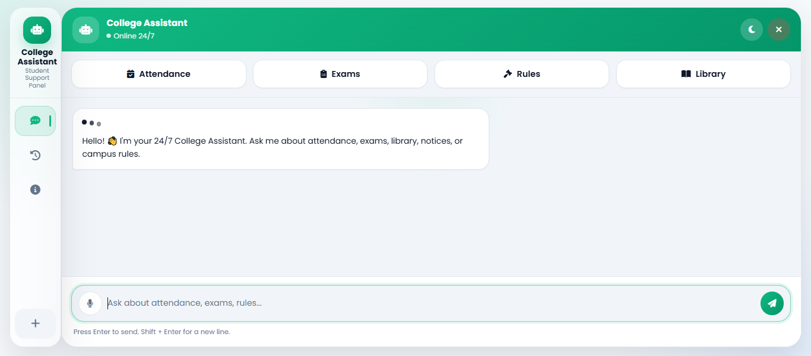
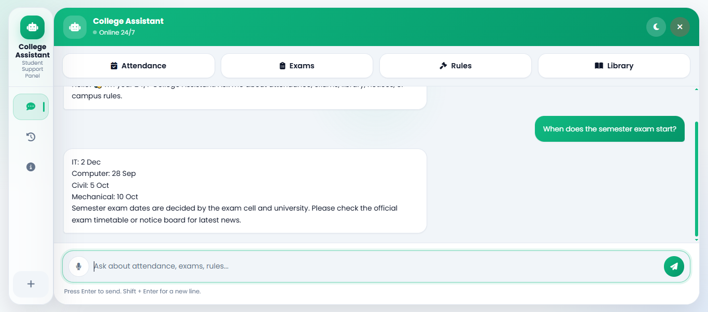
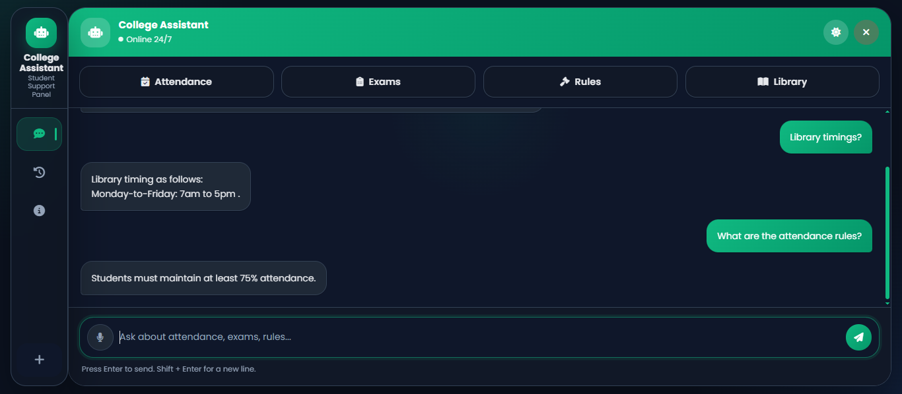
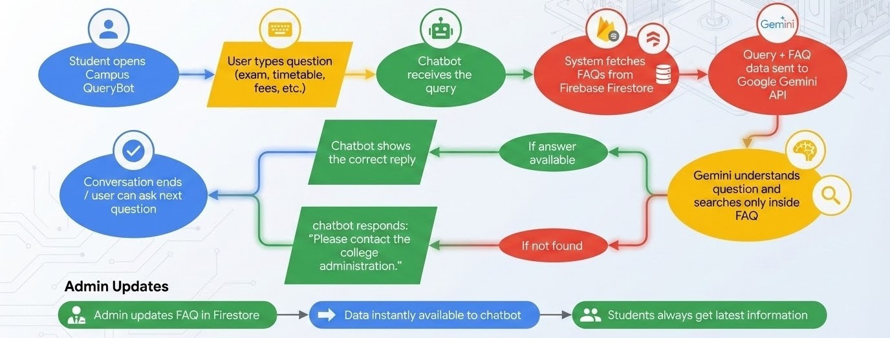
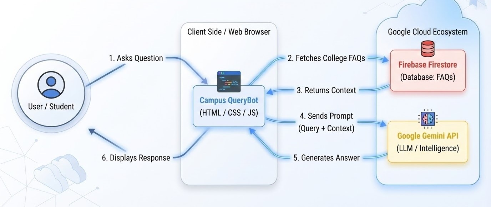

# 🏫 Campus QueryBot

> An intelligent FAQ-based chatbot for colleges — delivering instant, verified answers to student queries powered by **Google Gemini AI** and **Firebase Firestore**.

---

## 📸 Screenshots

> 

> 

> 

---

## 📌 Table of Contents

- [Overview](#overview)
- [Problem Statement](#problem-statement)
- [Features](#features)
- [Tech Stack](#tech-stack)
- [How It Works](#how-it-works)
- [Project Structure](#project-structure)
- [Getting Started](#getting-started)
- [Live Demo](#live-demo)
- [Future Scope](#future-scope)
- [Team](#team)

---

## Overview

**Campus QueryBot** is a college helpdesk chatbot that answers student questions instantly using a verified FAQ knowledge base. It eliminates repetitive queries directed at teachers and administrators by providing accurate, admin-approved responses 24/7.

Powered by **Google Gemini API** for intelligent natural language understanding and **Firebase Firestore** as the live FAQ database, the bot strictly answers only from verified data — preventing hallucinations or incorrect information.

---

## Problem Statement

Students at every college repeatedly ask the same questions:

- *"When are the exams?"*
- *"Where do I submit my forms?"*
- *"What is the fee structure?"*
- *"Who do I contact for attendance issues?"*

This creates unnecessary workload for faculty and administration. **Campus QueryBot automates this entirely.**

---

## Features

| Feature | Status |
|---|---|
| AI-powered chat interface | ✅ Implemented |
| FAQ stored in Firebase Firestore | ✅ Implemented |
| Gemini API integration with system instructions | ✅ Implemented |
| Answers restricted strictly to FAQ data | ✅ Implemented |
| Fallback message for unknown queries | ✅ Implemented |
| Dark / Light theme toggle | ✅ Implemented |
| Voice input support | ✅ Implemented |
| Chat history with local persistence | ✅ Implemented |
| Admin panel for FAQ management | 🔜 Planned |
| Multi-language support | 🔜 Planned |
| Student login & analytics | 🔜 Planned |

---

## Tech Stack

### AI & Backend
| Technology | Purpose |
|---|---|
| Google Gemini API | Natural language understanding and answer generation |
| Google AI Studio | Prompt engineering and system instruction configuration |
| Firebase Firestore | Cloud database for FAQ storage |
| Firebase Hosting | Web deployment and hosting |

### Frontend
| Technology | Purpose |
|---|---|
| HTML5 | UI structure and layout |
| CSS3 | Styling, animations, and theming |
| JavaScript ES6+ | Application logic, async API calls, state management |
| Web Speech API | Voice input functionality |

---

## How It Works



## System Architecture



---

## Getting Started

### Prerequisites
- A modern browser (Chrome recommended for voice input)
- [VS Code](https://code.visualstudio.com/) with Live Server extension
- A [Google Gemini API key](https://ai.google.dev/)
- Firebase project with Firestore enabled

### Steps

**1. Clone the repository**
```bash
git clone https://github.com/meet0411/chatbot.git
cd campus-querybot
```

**2. Add your Gemini API key**

Open `app.js` and replace the placeholder:
```js
const GEMINI_KEY = "YOUR_GEMINI_API_KEY_HERE";
```

**3. Configure Firebase**

Replace the `firebaseConfig` object in `app.js` with your own Firebase project credentials from the [Firebase Console](https://console.firebase.google.com/).

**4. Add FAQs to Firestore**

In Firebase Firestore, create a collection named `faqs`. Each document should have:
```
question: "What is the minimum attendance required?"
answer:   "The minimum attendance required is 75%."
```

**5. Run the project**

Open `index.html` with **VS Code Live Server** or any local server.

> ⚠️ Direct file open (`file://`) will not work due to ES module imports.

---

## Live Demo

🌐 **[https://chatbot-11042006.web.app](https://chatbot-11042006.web.app/)**


---

## Future Scope

- 🔹 **Admin Panel** — Add, edit, and delete FAQs from a dashboard without touching Firestore directly
- 🔹 **Student Login** — Personalized experience with Google Sign-In
- 🔹 **Analytics Dashboard** — Track most-asked questions to improve FAQ coverage
- 🔹 **Multi-language Support** — Serve students in regional languages
- 🔹 **Voice Output** — Text-to-speech bot responses
- 🔹 **Mobile App** — React Native or Flutter wrapper

---

## Team

**Code Mafia** — Vidyavardhini's College of Engineering & Technology
SE Computer Engineering (Second Year)

| Name | Role |
|---|---|
| Meet Agrawal | Developer |
| Pranav Bhatt | Developer |
| Ishan Chand | Developer |
| Varun Baliharia | Developer |

---

<p align="center">Built with ❤️ by Code Mafia &nbsp;|&nbsp; VCET, Mumbai</p>
